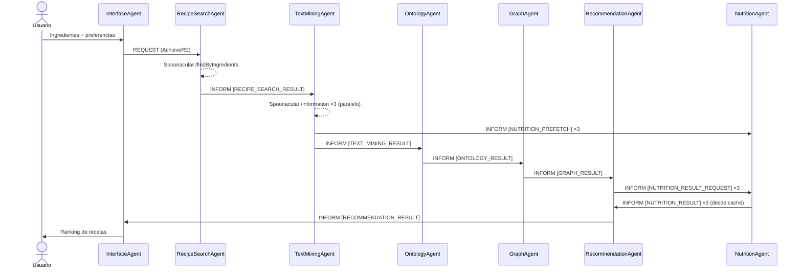

# 🍳 Sistema Multiagente Inteligente de Recomendación de Recetas


Sistema multiagente desarrollado en **Java** con **JADE** para recomendar recetas a partir de los ingredientes disponibles y las preferencias del usuario.

El sistema se basa en una arquitectura distribuida donde distintos agentes colaboran mediante mensajes ACL, descubrimiento dinámico de servicios usando el **Directory Facilitator (DF)** de JADE y procesamiento de información procedente de APIs externas, análisis textual, ontologías y datos nutricionales.

---
## 🎯 Objetivo del proyecto

El objetivo de este proyecto es aplicar conceptos de sistemas multiagente utilizando JADE para construir un recomendador inteligente de recetas capaz de colaborar mediante agentes especializados y procesamiento semántico.
---

## ✨ Características principales

- Arquitectura multiagente desacoplada.
- Comunicación entre agentes mediante `ACLMessage`.
- Descubrimiento dinámico de servicios mediante el DF de JADE.
- Búsqueda de recetas a partir de ingredientes introducidos por el usuario.
- Procesamiento textual de recetas e ingredientes.
- Uso de ontologías alimentarias para enriquecer la información.
- Análisis nutricional de recetas.
- Construcción de relaciones entre recetas e ingredientes.
- Sistema de recomendación basado en puntuaciones y ranking.
- Interfaz gráfica desarrollada en Java.
- Agente externo para pruebas de comunicación e interoperabilidad.

---

## 🛠️ Tecnologías utilizadas

- Java
- JADE
- Maven
- Gson
- Spoonacular API
- FoodOn Ontology
- Swing / Java GUI
- ACLMessages
- Directory Facilitator de JADE

---

## 🧠 Arquitectura del sistema

El sistema está compuesto por varios agentes especializados:

| Agente | Función |
|---|---|
| `InterfaceAgent` | Gestiona la interfaz gráfica y la interacción con el usuario |
| `RecipeSearchAgent` | Busca recetas a partir de los ingredientes introducidos |
| `TextMiningAgent` | Procesa texto de recetas, ingredientes e información asociada |
| `OntologyAgent` | Gestiona el procesamiento semántico mediante ontologías |
| `OntologyProcessor` | Apoya el tratamiento de información ontológica |
| `GraphAgent` | Construye relaciones entre recetas, ingredientes y resultados |
| `NutritionAgent` | Obtiene y gestiona información nutricional de las recetas |
| `RecommendationAgent` | Calcula la puntuación final y genera el ranking de recomendaciones |
| `ExternalAgent` | Permite probar la comunicación externa con el sistema |

---

## 🔄 Flujo general del sistema


### Pipeline principal



---

## ⚡ Funcionamiento interno

1. El usuario introduce ingredientes.
2. El sistema busca recetas externas.
3. Se procesan ingredientes mediante minería de texto y ontologías.
4. Se analizan relaciones y valores nutricionales.
5. Se genera un ranking de recomendaciones.
---

## 📡 Comunicación entre agentes

Los agentes se comunican mediante mensajes ACL propios de JADE.

El sistema utiliza:

- `ACLMessage`
- `MessageTemplate`
- `conversationId`
- Servicios registrados en el DF
- Behaviours especializados
- Bloqueo de comportamientos con `block()`

Ejemplos de conversaciones o servicios utilizados en el sistema:

```text
text-mining-service
nutrition-analysis
recommendation-service
graph-service
search-service
ontology-service
```

---

## 🔍 Descubrimiento dinámico de servicios

Los agentes registran sus servicios en el **Directory Facilitator** de JADE.

Esto permite que otros agentes puedan localizar servicios dinámicamente sin depender directamente del nombre concreto del agente.

Ejemplo:

```text
TextMiningAgent → text-mining-service
NutritionAgent → nutrition-analysis
```

---

## 📁 Estructura del proyecto

```text
src
└── main
    ├── java
    │   ├── agents
    │   │   ├── ExternalAgent.java
    │   │   ├── GraphAgent.java
    │   │   ├── InterfaceAgent.java
    │   │   ├── NutritionAgent.java
    │   │   ├── OntologyAgent.java
    │   │   ├── OntologyProcessor.java
    │   │   ├── RecipeSearchAgent.java
    │   │   ├── RecommendationAgent.java
    │   │   └── TextMiningAgent.java
    │   │
    │   ├── behaviours
    │   │   ├── graphbehaviours
    │   │   ├── interfacebehaviours
    │   │   ├── miningbehaviours
    │   │   ├── nutritionbehaviours
    │   │   ├── ontologybehaviours
    │   │   ├── recommendationbehaviours
    │   │   └── searchbehaviours
    │   │
    │   ├── model
    │   │   ├── GraphNode.java
    │   │   └── RecipeScore.java
    │   │
    │   ├── utils
    │   └── MainContainer.java
    │
    └── resources
```

---

## 🧩 Explicación detallada de la estructura

### 🤖 agents

Contiene todos los agentes principales del sistema multiagente.

| Archivo | Función |
|---|---|
| `InterfaceAgent.java` | Gestiona la interfaz gráfica y la comunicación inicial con el usuario |
| `RecipeSearchAgent.java` | Busca recetas utilizando APIs externas |
| `TextMiningAgent.java` | Procesa texto e ingredientes para enriquecer la búsqueda |
| `OntologyAgent.java` | Gestiona el procesamiento semántico y ontológico |
| `OntologyProcessor.java` | Clase auxiliar para operaciones relacionadas con ontologías |
| `GraphAgent.java` | Construye relaciones y similitudes entre recetas |
| `NutritionAgent.java` | Obtiene y analiza información nutricional |
| `RecommendationAgent.java` | Calcula puntuaciones y genera el ranking final |
| `ExternalAgent.java` | Permite probar comunicación externa e interoperabilidad |

---

### ⚙️ behaviours

Contiene los distintos comportamientos (`Behaviours`) utilizados por los agentes.

En JADE, los behaviours representan las tareas o acciones que ejecuta cada agente.

---

### 🕸️ graphbehaviours

Behaviours relacionados con la construcción y análisis de relaciones entre recetas e ingredientes.

| Archivo | Función |
|---|---|
| `GraphBehaviour.java` | Construye un grafo bipartito entre los ingredientes del usuario y los de cada receta. Calcula el `coverageScore` (porcentaje de ingredientes de la receta cubiertos por el usuario) y el `utilizationScore` (porcentaje de ingredientes del usuario que usa la receta) |

---

### 🖥️ interfacebehaviours

Behaviours asociados a la interfaz gráfica y la comunicación con el usuario.

| Archivo | Función |
|---|---|
| `InterfaceAgentBehaviours.java` | Gestiona la entrada del usuario por la interfaz gráfica, envía la petición a `RecipeSearchAgent` y muestra el ranking de recetas recibido de `RecommendationAgent` |

---

### 🧪 miningbehaviours

Behaviours encargados del procesamiento textual y la minería de información.

| Archivo | Función |
|---|---|
| `TextMiningBehaviour.java` | Llama a Spoonacular en paralelo para obtener ingredientes, cantidades, etiquetas dietéticas, tiempos y nutrición de cada receta. Aplica TF-IDF sobre ingredientes usando un corpus de 2M recetas y calcula la similitud coseno con los ingredientes del usuario. Envía los resultados a `OntologyAgent` y pre-cachea la nutrición en `NutritionAgent` |

---

### 🥗 nutritionbehaviours

Behaviours relacionados con el análisis nutricional de recetas.

| Archivo | Función |
|---|---|
| `NutritionBehaviour.java` | Escucha dos tipos de mensajes: `NUTRITION_PREFETCH` (datos de nutrición enviados por `TextMiningAgent` para guardar en caché) y `NUTRITION_RESULT_REQUEST` (peticiones de `RecommendationAgent` que responde desde caché, o llamando a Spoonacular como fallback) |

---

### 📚 ontologybehaviours

Clases encargadas del tratamiento semántico y ontológico de ingredientes.

| Archivo | Función |
|---|---|
| `FoodOntology.java` | Carga y gestiona la ontología alimentaria `foodon.owl`. Proporciona reglas de sustitución entre ingredientes para ampliar las coincidencias entre lo que tiene el usuario y lo que necesita cada receta |
| `FoodCategory.java` | Representa las categorías alimentarias definidas en la ontología (proteínas, lácteos, verduras, etc.) |
| `SubstitutionRule.java` | Representa una regla de sustitución individual entre dos ingredientes (p.ej. leche de avena → leche) |

---

### ⭐ recommendationbehaviours

Behaviours responsables de calcular las puntuaciones finales y generar el ranking de recomendaciones.

| Archivo | Función |
|---|---|
| `RecommendationBehaviour.java` | Recibe los scores del grafo, aplica filtros de restricciones dietéticas y penalización por tiempo, solicita datos nutricionales a `NutritionAgent` y calcula la puntuación final: `0.50 × coverage + 0.20 × utilization + 0.30 × tfidf`. Envía el ranking ordenado a `InterfaceAgent` |

---

### 🔎 searchbehaviours

Behaviours encargados de la búsqueda de recetas en APIs externas.

| Archivo | Función |
|---|---|
| `SearchBehaviour.java` | Recibe los ingredientes del usuario desde `InterfaceAgent`, llama a la API de Spoonacular (`/findByIngredients`) y envía las recetas encontradas a `TextMiningAgent` con el contexto del usuario (preferencias, restricciones, cantidades, número de personas) |

---

### 📦 model

Contiene las clases utilizadas para representar estructuras de datos del sistema.

| Archivo | Función |
|---|---|
| `GraphNode.java` | Representa un nodo dentro del grafo bipartito de relaciones entre ingredientes y recetas |
| `RecipeScore.java` | Almacena todas las puntuaciones calculadas para una receta: `graphScore`, `coverageScore`, `utilizationScore`, `tfidfScore` y `finalScore`, junto con instrucciones, etiquetas dietéticas y puntuación de salud |


---

### 🧰 utils

Contiene clases auxiliares y utilidades reutilizables utilizadas por distintos agentes y behaviours del sistema.

Estas clases permiten centralizar lógica común y facilitar tareas como el procesamiento de ingredientes, comunicación entre agentes o manejo de ontologías.

| Archivo | Función |
|---|---|
| `AutoCompleteComboBox.java` | Implementa autocompletado en los campos de entrada de la interfaz gráfica |
| `DFUtils.java` | Facilita el registro y descubrimiento de servicios en el Directory Facilitator (DF) de JADE |
| `IngredientStemmer.java` | Realiza stemming y normalización de ingredientes para mejorar coincidencias |
| `IngredientTranslator.java` | Traduce ingredientes entre distintos idiomas para mejorar la búsqueda y compatibilidad |
| `RestrictionChecker.java` | Comprueba restricciones alimentarias o incompatibilidades en recetas |
| `foodon.owl` | Ontología alimentaria utilizada para procesamiento semántico y relaciones entre ingredientes |

Estas utilidades ayudan a mantener el sistema modular y evitan duplicación de código entre agentes y behaviours.

---


### 📂 resources

Contiene recursos externos y archivos auxiliares necesarios para el funcionamiento del sistema.

| Archivo | Función |
|---|---|
| `idf_corpus.json` | Corpus utilizado para cálculos de relevancia y procesamiento textual de ingredientes y recetas |

Este archivo se utiliza principalmente durante el procesamiento textual realizado por el `TextMiningAgent`, permitiendo calcular pesos y relevancia de términos dentro del sistema de recomendación.

---

### 🚀 MainContainer.java

Clase principal encargada de:

- Iniciar el contenedor principal de JADE.
- Crear e inicializar todos los agentes.
- Registrar servicios en el DF.
- Arrancar la comunicación entre agentes.

Es el punto de entrada principal del sistema.

---

## 💻 Instalación del proyecto

### 1. Clonar el repositorio

```bash
git clone https://github.com/diegojgarciacallejas/sis_int-sistema-recomendador-recetas.git
```

---

### 2. Abrir el proyecto

Abrir la carpeta del proyecto en IntelliJ IDEA o en otro entorno compatible con Java.

---

### 3. Configurar Java

Comprobar que el proyecto tiene configurado un SDK de Java compatible.

En IntelliJ IDEA:

```text
File → Project Structure → Project SDK
```

---

### 4. Cargar dependencias

El proyecto incluye librerías externas necesarias para el funcionamiento del sistema dentro de la carpeta:

```text
/libs
```

Las principales dependencias utilizadas son:

| Librería | Función |
|---|---|
| `jade.jar` | Framework principal para el desarrollo del sistema multiagente |
| `gson-2.10.1.jar` | Procesamiento y manejo de archivos JSON |
| `owlapi-distribution-3.5.6.jar` | Gestión y procesamiento de ontologías OWL |
| `guava-18.0.jar` | Librería auxiliar de utilidades para Java |
| `trove4j-3.0.3.jar` | Optimización de estructuras de datos y colecciones |

En IntelliJ IDEA:

```text
File → Project Structure → Modules → Dependencies
```

Añadir los `.jar` necesarios desde la carpeta `libs`.

---

## ▶️ Ejecución del sistema

### 🚀 Ejecutar el contenedor principal

Ejecutar la clase:

```text
MainContainer.java
```

Esta clase inicia el contenedor principal de JADE y crea los agentes principales del sistema:

```text
InterfaceAgent
RecipeSearchAgent
TextMiningAgent
OntologyAgent
GraphAgent
NutritionAgent
RecommendationAgent
ExternalAgent
```

---

## 🍝 Ejemplo de uso

### Entrada del usuario

El usuario introduce los siguientes datos en la interfaz gráfica:

| Campo | Ejemplo |
|---|---|
| Ingredientes | `tomato, pasta, cheese` |
| Cantidades | `tomato:200, pasta:250, cheese:100` |
| Número de personas | `2` |
| Tiempo máximo | `45` min |
| Restricciones dietéticas | `vegetarian` |

---

### Resultado

El sistema devuelve una lista de recetas recomendadas ordenadas por puntuación final:

```text
🏆 Ranking de recetas recomendadas

━━━━━━━━━━━━━━━━━━━━━━━━━━━━━━━━━━━━━━

#1 Pasta Carbonara
   ✓ Great match: you have over 65% of the required ingredients.
   ⏱ 25 min  👤 2 servings  ❤ Health: 74/100

#2 Pizza Margarita
   ~ Acceptable match: you share some key ingredients.
   ⏱ 40 min  👤 2 servings  ❤ Health: 68/100

#3 Lasagna
   ~ Acceptable match: you share some key ingredients.
   ⏱ 45 min  👤 4 servings  ❤ Health: 61/100
```
---

## 📊 Modelos principales

El proyecto incluye clases de modelo para representar información utilizada durante la recomendación:

| Clase | Función |
|---|---|
| `GraphNode` | Representa nodos dentro del grafo de relaciones |
| `RecipeScore` | Representa la puntuación asociada a una receta |

---

## 🔮 Posibles mejoras futuras

Aunque las posibilidades de mejora del sistema son amplias, algunas posibles líneas futuras de desarrollo serían:

- Mejorar considerablemente la interfaz gráfica y la experiencia de usuario.
- Añadir búsqueda de recetas mediante imágenes de alimentos o ingredientes.
- Mejorar el sistema de sustitución de ingredientes utilizando ontologías y penalizaciones inteligentes según la similitud real entre alimentos.
- Incorporar recomendaciones nutricionales más avanzadas y personalizadas.
- Añadir persistencia de historial y recetas favoritas de cada usuario.
- Integrar modelos de IA más avanzados para mejorar la calidad de las recomendaciones.

Estas mejoras representan únicamente algunos ejemplos de posibles ampliaciones futuras del proyecto.

---

## 🤖 Uso de Inteligencia Artificial

Durante el desarrollo se ha utilizado inteligencia artificial como herramienta de apoyo.

Principalmente nos ha ayudado en:

- Comprender mejor código Java, ya que el grupo tiene más experiencia previa con Python.
- Crear una primera versión de la interfaz gráfica, porque no teníamos muchas bases de frontend o desarrollo visual.
- Depurar errores propios del desarrollo en Java.
- Entender mensajes de error y posibles soluciones.
- Mejorar la organización inicial del código y del README.

La IA no sustituye el trabajo del grupo, sino que se ha usado como apoyo para aprender, resolver dudas y acelerar tareas puntuales del desarrollo.

---

## 👨‍💻 Autores

Grupo 4 — Sistemas Inteligentes 2025-26

- Mario Martín Muñoz
- Diego José García Callejas
- Héctor Fernández Cano
- Abdelaziz Aarourou Uarda
- Pablo de Tarso Pedraz García

---

## 📜 Licencia

Proyecto desarrollado con fines académicos para la asignatura de Sistemas Inteligentes.

El repositorio incluye licencia MIT.